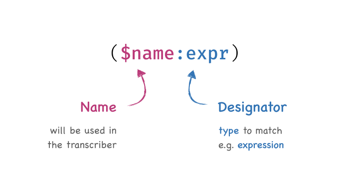

# 为什么Rust的println!不会发生所有权转移？



`println!`可能是学习Rust最常用的一行代码了。我们连续多次调用它，下面的代码编译通过，再正常不过了。

```rust
let x = String::from("Hello!");
println!("{}", x);
println!("{}", x);
```

> Hello!
>
> Hello!

可是，我们明明传的是`x`，并非`&x`，为什么没有发生所有权转移呢？

查查标准库的源码，如下：

```rust
#[macro_export]
#[stable(feature = "rust1", since = "1.0.0")]
#[allow_internal_unstable(print_internals, format_args_nl)]
macro_rules! println {
    () => ($crate::print!("\n"));
    ($($arg:tt)*) => ({
        $crate::io::_print($crate::format_args_nl!($($arg)*));
    })
}

#[unstable(
    feature = "format_args_nl",
    issue = "none",
    reason = "`format_args_nl` is only for internal \
    	      language use and is subject to change"
    )]
#[allow_internal_unstable(fmt_internals)]
#[rustc_builtin_macro]
#[macro_export]
macro_rules! format_args_nl {
    ($fmt:expr) => {{ /* compiler built-in */ }};
    ($fmt:expr, $($args:tt)*) => {{ /* compiler built-in */ }};
}
```

更让人眼花缭乱了，就算啃得动Rust宏，啃到最后那句“compiler built-in”，也足以让人崩溃。还是换个思路。

所谓“元编程”的Rust宏，是在编译期进行展开，那如果能看到展开后的Rust代码，可读性就好很多了。

对于Rust，想看宏展开后的代码，当然不是问题，真要夸夸Rust的工具链了，非常周到。唯一一个要求，就是需要切换到**[Rust Nightly](https://doc.rust-lang.org/book/appendix-07-nightly-rust.html)**版本。

先从安装开始。

> \> rustup toolchain install nightly

装好后可以看到默认是Stable版本。

> \> rustup toolchain list 
>
> stable-x86_64-pc-windows-msvc (default) 
>
> beta-x86_64-pc-windows-msvc 
>
> nightly-x86_64-pc-windows-msvc

从Stable切换到Nightly也非常简单。

> \> cd ~/projects/print
>
> \> rustup override set nightly

万事具备，进行展开，输入：

> \> rustc --pretty expanded -Z unstable-options main.rs

```rust
#![feature(prelude_import)]
#![no_std]
#[prelude_import]
use ::std::prelude::v1::*;
#[macro_use]
extern crate std;
fn main() {
    let x = String::from("Hello!");
    {
        ::std::io::_print(::core::fmt::Arguments::new_v1(&["", "\n"],
                                                         &match (&x,) {
                                                             (arg0,) => [::core::fmt::ArgumentV1::new(arg0,::core::fmt::Display::fmt)],
        }));
    };
}
```

此时，在终端里会打印出将宏展开后的代码，如果拷贝覆盖粘贴进main.rs，一样是可以编译通过并运行的。

说到这里，关于问题的答案也已明了，展开代码显示：**println!实际生成的代码使用了`&x`，不可变借用**。

最后，记得切回Stable：

> \> rustup override set stable