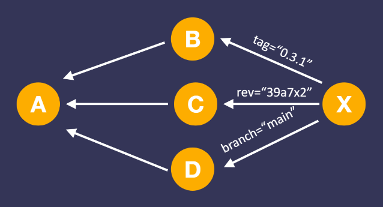

# 回撸Rust China Conf 2020 之《Rust企业级应用最佳实践》


本篇回撸一把《Rust企业级应用最佳实践》，讲者分享了Rust应用的”最后一公里“中所解决的问题和有效实践，非常接地气。

Speaker: Liao Yiming ([廖意明](https://github.com/baoyachi)) 

[视频](https://www.bilibili.com/video/BV1Yy4y1e7zR?p=32) [PDF](https://github.com/rustcc/RustChinaConf2020/blob/master/rustchinaconf2020/RustChinaConf2020-32.%E5%BB%96%E6%84%8F%E6%98%8E-%E3%80%8ARust%E4%BC%81%E4%B8%9A%E7%BA%A7%E5%BA%94%E7%94%A8%E6%9C%80%E4%BD%B3%E5%AE%9E%E8%B7%B5%E3%80%8B.pdf)

## 1. 面向CI的Cargo工具

```yml
stages:
	- build
build_release:
	stage: build
	script:
		- ...
		- cargo fmt
		- cargo fix
		- cargo fix
		- RUSTFLAGS="-D warnings" cargo clippy
		- cargo build --release
```

本章节分享的最佳实践：在做人工的Code Review之前，尽可能的利用自动化检查工具进行预审查，并展示了一个构件脚本。

这个脚本要求开发者在提交时，要在本地做好`cargo fmt`、`fix`、`clippy`，否则CI流水线是无法通过的。

脚本中有两处`cargo fix`，是一个trick：如果在第一处cargo fix修改了代码，就会导致第二个`cargo fix`因为code dirty而无法通过。

接下来的`cargo clippy`的 `-D warnings`参数，表示构建不接受warning，开发者可以在代码中添加`#![deny(warnings)]`，或者在本地运行`cargo clippy -- -D warnings`来检查是否满足该要求。

## 2. SemVer


本章节介绍了定义依赖时的语义化版本的概念，如上图。

下面是一些自定义升级策略的例子。其中"^0.2.3"之所以不能自动升级到“1.0.0”是因为在语义化版本中，第一位Major位为0，表示不稳定，所以升级幅度会有限制。

```toml
[dependencies]
kov = "=1.2.3" 			# 可用版本：1.2.
kov = "^1.2.3" 			# 可用版本：>= 1.2.3 且 < 2.0.0
kov = "^1.2"   			# 可用版本：>= 1.2.0 且 < 2.0.0
kov = "^1"	   			# 可用版本：>= 1.0.0 且 < 2.0.0
kov = "^0.2.3" 			# 可用版本：>= 0.2.3 且 < 0.3.0
kov = "^0.2"   			# 可用版本：>= 0.2.0 且 < 0.3.0
kov = "^0.0.3" 			# 可用版本：>= 0.0.3 且 < 0.0.4
kov = "^0.0"   			# 可用版本：>= 0.0.0 且 < 0.1.0
kov = "^0"     			# 可用版本：>= 0.0.0 且 < 1.0.0
kov = "*"      			# 可用版本：>= 0.0.0
kov = "1.*"    			# 可用版本：>= 1.0.0 且 < 2.0.0
kov = "1.2.*"  			# 可用版本：>= 1.0.0 且 < 2.0.0
kov = ">1.2.3" 			# 可用版本：> 1.2.3
kov = ">1.2.3 <1.2.17" 	# 可用版本：> 1.2.3 且 < 1.2.17
kov = "<=1.2.3" 		# 可用版本：<= 1.2.3
```

如果大家想去试更多的case，可以试下这个在线计算器[semver calculator](https://semver.npmjs.com/)。

讲者在本章节分享了自己遇到的几次“饭后编译失败”的经历。造成的原因是：**语义化版本的兼容性，是由开发者人为保证的**，所以有可能出错。如果出现了因为`Cargo Update`导致的编译失败，可以通过前面的`kov = "=1.2.3"`强制锁定版本来解决。

本章关于语义化版本的最佳实践：

- 不要使用通配符`*`；
- 尽可能明确版本“x.y.z”，并通过`cargo update -p cratename`来指定升级，而不要`cargo update`进行大面积升级；

- 对于crate提供者，一旦出现兼容性问题，马上进行`cargo yank`，可以阻止还没用过问题版本的用户看到此版本。

## 3. 私库依赖

`Cargo.toml`中的依赖，除了指定语义化版本之外，在**私有代码**场景中，还可以用git依赖的方式，比如下面列举的默认分支、指定分支、commit id、tag等等。

```toml
rand = {git="https://github.com/rust-lang-nursey/rand"}
rand = {git="https://github.com/rust-lang-nursey/rand", branch="next"}
rand = {git="https://github.com/rust-lang-nursey/rand", rev="39a7x2"}
rand = {git="https://github.com/rust-lang-nursey/rand",tag="0.3.1"}
```

但是，这会带来“多模块依赖问题”的问题。如下图所示：



```powershell
Error: perhaps two different version of crate 'x' are being used?
```

讲者分享了他发现的一个解决方案：在Rust 1.34.0引入的Alternate Register，可以向私有库进行语义化版本的发布：

- ~/.cargo/config

```toml
[registries]
my-registry={index="https://my-intranet:8080/git/index"}
```

- cargo login --registry=my-registry
- cargo publish --registry=my-registry
- Cargo.toml

```toml
[dependencies]
other-crate={version="1.0",registry="my-registry"}
```

最后讲者还建议：**避免由开发者在本地进行随意的发布，应该在CI流水线在合适的时机进行自动化发布**。

## 4. 构建脚本

本章分享了Rust的构建脚本，在`Cargo.toml`中的`package`中添加build项，如下图所示。其中`build.rs`文件目录同`Cargo.toml`即可。

```toml
[package]
name = "demo"
version = "1.0.0"
edition = "2018"
build = "build.rs"
```

构建脚本，可以把很多额外的信息动态加入到编译后的可执行文件中，包括可执行文件的当前版本、编译环境、系统版本等，方便追溯。

为了更快捷的创建构建脚本，讲者开源了一个构建脚本工具[shadow-rs](https://github.com/baoyachi/shadow-rs)：shadow-rs allows you to recall properties of the build process and environment at runtime, including:

- Cargo.toml project version 
- Dependency information 
- The Git commit that produced the build artifact (binary) 
- What version of the rust toolchain was used in compilation 
- The build variant, e.g. debug or release
-  (And more)

来加颗star吧。