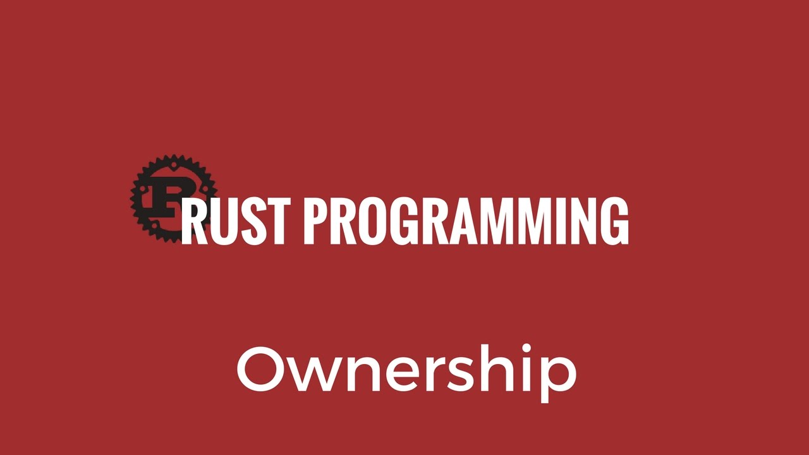

# 释放堆内存，Rust是怎么做的？所有权！

本篇谈下Rust语言的核心概念：所有权。

这个概念是支撑Rust在编译期做内存安全检查的核心机制，也正是因为这个特性，我们认为Rust是**内存安全**的**底层**语言。虽然带GC垃圾回收器的语言虽然也是内存安全的，但由于GC的存在，已与底层无缘。



## 栈和堆

当说到语言的内存管理时，通常指的是对于堆的管理，而栈的使用都是自动的，通常都不需要程序员特别关心。

### 栈

**栈，是一种数据“后进先出”的存取方式，速度非常快**。《Rust权威指南》里对于栈的形容非常贴切：

> 你可以把栈上的操作想象成堆放盘子：当你需要放置盘子时，你只能将它们放置在栈的顶部，而当你需要取出盘子时，你也只能从顶部取出。

源代码的层面，一般已知大小、声明性的变量都会使用栈上的空间。当然，系统默认给到程序的栈空间都不大，Windows的默认栈只有1M。


### 堆

**堆，可以理解为在编译期无法确定的内存开销，需要在运行期动态申请**。堆没有栈高效，通常要向系统申请，系统经过搜索，找到一块足够大的空间，才能锁定交付。堆所能申请到的空间，相比栈大很多，通常是系统的虚拟内存大小的级别，比如32位系统有4G的虚拟内存空间，那么可以申请到2G~3G大小的内存空间。

而能否直接进行堆内存的操作，可以粗略的将编程语言分为两类，底层和高级：

- 能够直接手工操作**堆**的语言，这类语言有着最大的灵活性、执行效率高，多用于系统编程，代表语言：C，C++。

- 不能直接操作**堆**的语言，这类语言通常带有GC垃圾自动回收器，性能会受一定影响，但是开发效率高，多用于业务编程，代表语言：Java，Python。

本篇要介绍的**Rust的所有权机制，属于前者，具备了底层语言的灵活性；但同时却能避免手工操作堆内存带来的危险性，具备了高级语言的高效性和安全性，可谓鱼和熊掌可以兼得**。

接下来，为了解释清楚Rust的堆操作机制，我们先逐一看看各种堆操作方式。

## 堆管理方法一：纯手工

**80后程序员一般都经历过C++98的洗礼，那段时光，关键字new和delete的魔咒就未消停过**。

下面代码是创建一个100x1的灰度图像所需要的空间，但是对于一个“老练的”程序员，总要把下面情况烂熟于心：

- 总需要在图像使用后，记得销毁它，否则直接造成内存泄露；
- 销毁后，原来的指针会变成“野指针”，如果再次使用，或者重复释放被重新分配的内存，都会导致无法预测的错误，于是我们干脆把指针变量设为NULL；
- 可能有段逻辑还会尝试使用它，最好先判断下它不为NULL，避免抛异常；

上面的实践，如果一个不小心，bug就潜伏进来，而且工程越大越难找。程序员的心智压力可见一斑，这也是为什么我们需要《Effective C++》这本书的原因。

```c++
{
    unsigned __int8* p_gray = new unsigned __int8[100]();

    delete p_gray;
    p_gray = NULL;

    if (p_gray != NULL)
    {
        cout << p_gray[0] << endl;
    }
}
```

## 堆管理方法二：GC垃圾回收

同样一句创建8位字节数组的Java代码，程序员只要“拿来”即可，“还回去”的事则不必亲自费心。那谁操心呢？总得有人操心——JVM，Java虚拟机，更准确的说，是其中的自动垃圾回收器。

自动垃圾回收，因为不是程序员直接的意图指令，所以**GC就得靠自己分析垃圾特征，见机行事**。自动化内存管理是实现了，但**天下没有免费的午餐**，回收时所需要的一小段时间，会让整个Java程序进入臭名昭著的“Stop-the-World”状态。

```java
{
    byte[] arrayRefVar = new byte[100];
}
```

## 堆管理方法三：所有权

Rust作为静态编译型语言，显然没有运行期虚拟机的夹持，那么想要做到内存安全，就得从两个方面下手：

- 自动化内存管理；
- 把内存安全检查提前到编译期；

做到第一点并不难，其实RAII（**R**esource **A**cquisition **I**s **I**nitialization）已经在C++有着很广泛的应用了。

RAII的思想是：资源的有效期与持有资源的对象的生命期严格绑定，即由对象的构造函数完成资源的分配，同时由析构函数完成资源的释放。在这种要求下，只要对象能正确的析构，就不会出现资源泄露问题。

C++应用RAII是以模式（Pattern），或者最佳实践这种松散方式来实现的。Rust要想做到第二点，就需要把这种思想集成进语言本身，让编译器能看得懂。

Rust提出了所有权：

- **Rust中的每个值都有一个对应的变量作为它的所有者；**
- **在同一时间内，只有且仅有一个所有者；**
- **当所有者离开自己的作用域时，它持有的值就会被释放掉。**

我们用Rust再实现一次创建8位无符号整数数组：

```rust
{
    let v: Vec<u8> = vec![0;100];
} // v作为数组的所有者，在离开作用域时，销毁了所持有的内存。
```

和Java一样，只需要一行代码就完成了在堆上的内存申请。但Rust做得更多——在离开作用域的同时，确定性的销毁了堆上的内存，而完全不需要一个拖泥带水的GC。

**可谓干净利落，身手不凡**。